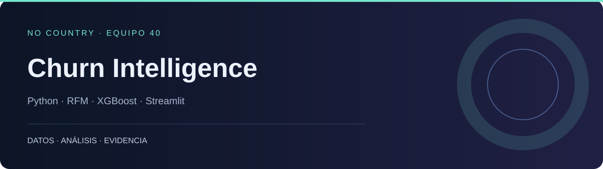

# Churn Intelligence

**Del comportamiento de compra a segmentos de riesgo y escenarios de retención.**

NO COUNTRY · EQUIPO 40 · Python · RFM · XGBoost · Streamlit

[No Country Showcase](https://nocountry.tech/showcase/simulacion-laboral-marzo-2026/equipo-40-data-science) · [Portafolio](https://dodysalim.github.io/) · [Caso y alcance](docs/PORTFOLIO_CASE.md) · [Verificación](docs/VALIDATION.md)

## La pregunta

¿Qué clientes muestran señales de abandono y qué segmentos concentran el valor expuesto?

## Qué puedes revisar

- Preprocesamiento de transacciones, RFM y etiquetado de churn.
- Pipelines de entrenamiento, evaluación y exportación.
- Dashboard de cinco vistas, con demostración sintética identificada.

## Inicio local

Usa Python 3.11 o 3.12 en un entorno independiente. Desde la raíz:

```bash
python -m venv .venv
# Windows: .venv\Scripts\activate
# macOS/Linux: source .venv/bin/activate
python -m pip install -r requirements.txt
python -m pip install -r requirements-dev.txt
```

Después de configurar los datos:

```bash
python -m streamlit run Dashboard/webapp/app.py
```

## Datos y configuración

La demostración funciona sin Supabase con 800 clientes sintéticos. Para usar las vistas reales, configura SUPABASE_URL y SUPABASE_KEY (clave de lectura con RLS). Los importes conservan las unidades de origen.

## Power BI · PC y móvil

[Archivos e instrucciones](powerbi/README.md). Descarga el repositorio completo y abre `powerbi/Abrir-PowerBI.bat` en Windows; después pulsa **Actualizar**. Incluye A4 horizontal a tamaño real (100 %) y diseño móvil vertical. El archivo `.pbip` necesita sus carpetas Report, SemanticModel y data.

## Recorrido por el código

| Ruta | Qué contiene |
| --- | --- |
| [src/](src/) | Limpieza, características, modelos y segmentación |
| [pipelines/](pipelines/) | Entrenamiento, inferencia y exportación |
| [Dashboard/webapp/](Dashboard/webapp/) | Interfaz Streamlit |
| [sql/](sql/) | Esquema y vistas de Supabase |
| [tests/](tests/) | Pruebas unitarias |

## Comprobación y alcance

25 pruebas aprobadas, incluidas cinco regresiones de datos del dashboard. Inicio y cinco páginas probados en modo demo sin excepciones.

Los datos demo, tendencias ilustrativas y ROI de escenarios no son resultados observados. No se repitió el entrenamiento sobre Online Retail II ni se comprobó Supabase en vivo.

Para repetir las pruebas desde la raíz:

```bash
python -m pytest tests -q
```

## Autoría

Simulación No Country, Sprint 3, Equipo 40. Se mantiene la atribución colectiva y la documentación original.


### Equipo · Marzo 2026

| Integrante | Rol publicado |
| --- | --- |
| Lucel | Data |
| Junior Alexis | Data Scientist |
| Geyson David | Data Scientist |
| Dody | Data analyst |

Créditos basados en el [showcase oficial](https://nocountry.tech/showcase/simulacion-laboral-marzo-2026/equipo-40-data-science). Se conserva la autoría colectiva.

[Documentación anterior](docs/ORIGINAL_README.md), conservada como referencia histórica.
